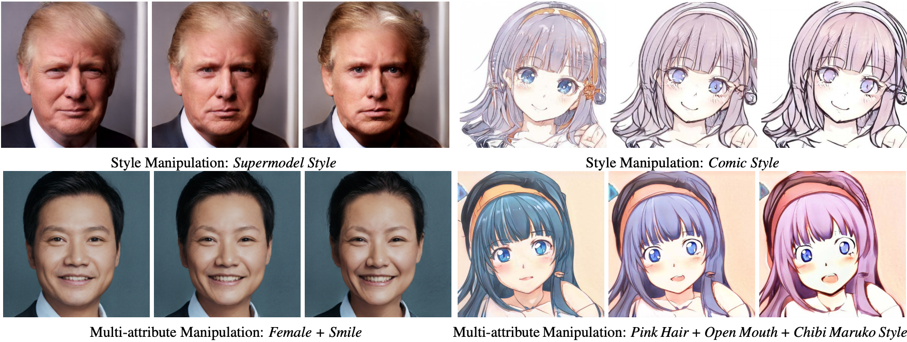

# AdvStyle - Official PyTorch Implementation

[Paper ](https://openaccess.thecvf.com/content/CVPR2021/papers/Yang_Discovering_Interpretable_Latent_Space_Directions_of_GANs_Beyond_Binary_Attributes_CVPR_2021_paper.pdf)| [Supp](https://openaccess.thecvf.com/content/CVPR2021/supplemental/Yang_Discovering_Interpretable_Latent_CVPR_2021_supplemental.pdf) 



Discovering Interpretable Latent Space Directions of GANs Beyond Binary Attributes.

Huiting Yang, Liangyu Chai, Qiang Wen, Shuang Zhao, Zixun Sun, [Shengfeng He](http://www.shengfenghe.com/)

*In CVPR 2021*

## Prerequisites

- Linux
- Python 3
- NVIDIA GPU + CUDA CuDNN

## Setup

- Clone this repo:

```bash
git clone https://github.com/BERYLSHEEP/AdvStyle.git
```

- Download resources:
  - Please download the pretrained [FFHQ StyleGAN](https://drive.google.com/file/d/1ivK934PJg1EjitAD2NKJK4h7jrXX1L41/view?usp=sharing) and [anime StyleGAN](https://drive.google.com/file/d/1bqnygCUrpMHCLytkV18JWNEqC-RQU1at/view?usp=sharing) weights
  - Move the weights to `models/pretrain/pytorch`

## Testing Demo

The following commands are examples of testing the learned direction:

```bash
# stylegan ffhq
python new_demo.py manipulate_test supermodel \
				--gan_model stylegan_ffhq --resolution 1024 --latent_type z
	
# stylegan anime
python new_demo.py manipulate_test maruko \
				--gan_model stylegan_anime --resolution 512 --latent_type z
```

if you want to manipulate multi attributes simultaneously, you can list all the attributes on the command as follow:

```bash
# multi attribute manipulation
python new_demo.py manipulate_test blonde,open_mouth \
				--gan_model stylegan_anime --resolution 512 --latent_type z
```

If you want to specific the manipulated latent code, you can set the *--noise_path* option:

```bash
# specific latent code
python new_demo.py manipulate_test maruko \
				--gan_model stylegan_anime --resolution 512 --latent_type z \
				--noise_path ./noise/maruko/2.npy
```

Results are saved to `result/{attribute}`

The attribute names are the file names in the `boundaries`  directory.

## Related Project

- The pretrained StyleGAN weights are from official [StyleGAN](https://github.com/NVlabs/stylegan) and [Gwern](https://www.gwern.net/Faces#anime-faces)
- Using the pytorch implementation of StyleGAN from [InterFaceGAN](Pytorch implementation of official model) 

### Citation

If you use this code for your research, please cite our paper:

```BibLatex
@InProceedings{Yang_2021_CVPR,
    author    = {Yang, Huiting and Chai, Liangyu and Wen, Qiang and Zhao, Shuang and Sun, Zixun and He, Shengfeng},
    title     = {Discovering Interpretable Latent Space Directions of GANs Beyond Binary Attributes},
    booktitle = {Proceedings of the IEEE/CVF Conference on Computer Vision and Pattern Recognition (CVPR)},
    month     = {June},
    year      = {2021},
    pages     = {12177-12185}
}
```


